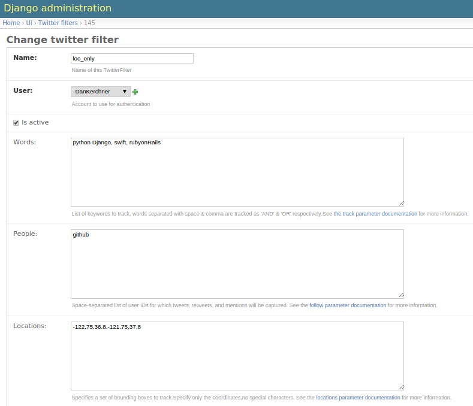

Management Commands
====================

Introduction
------------

Many of the key back-end functions of Social Feed Manager
(SFM) are invoked using management commands.  The SFM
management commands are standard `Django management commands
<https://docs.djangoproject.com/en/1.6/ref/django-admin/>`_.  As such,
they are invoked like any other Django management commands:

1. First make sure that your virtualenv is activated.

.. code-block:: none

   $ source ENV/bin/activate

2. From ``<PROJECT_ROOT>/sfm``, execute ``./manage.py`` followed by the
   desired management command, arguments and options.

.. code-block:: none

   $ cd sfm
   $ ./manage.py <command> [args] [options]

SFM management commands may be run:

* manually (i.e. at the command line),
* using cron jobs, and/or
* using supervisord (in the case of filterstream and streamsample)
  as described in the section on :doc:`supervisor and streams
  </supervisor_and_streams>`.

Each SFM management command is described below.

.. _`user_timeline`:

user_timeline
-------------

*user_timeline* calls the Twitter API to retrieve the available tweets
for either all *active* TwitterUsers in SFM, or for a specific *active*
TwitterUser.  Each tweet is created as a TwitterItem in SFM.

user_timeline connects to the Twitter API as
``TWITTER_DEFAULT_USERNAME``, and requests the user_timeline
by the Twitter account uid (not by account name).  Through the
tweepy library, it calls the `Twitter API user_timeline method
<https://dev.twitter.com/docs/api/1/get/statuses/user_timeline>`_.

For each TwitterUser user_timeline requests only tweets since the newest
tweet that was previously retrieved.  If no tweets were previously
retrieved for that TwitterUser, it requests as many tweets as the Twitter
API will provide (up to the 3200 most recent tweets).

To fetch tweets for all active TwitterUsers in SFM:

.. code-block:: none

   ./manage.py user_timeline

To fetch tweets for a specific twitter user:

.. code-block:: none

   ./manage.py user_timeline --user='twitter username'

The full specification of user_timeline options can be viewed using
--help:

.. code-block:: none

   ./manage user_timeline --help

Sample output for user_timeline:

.. code-block:: none
    
    user: pinkfloyd
    since: 1
    saved: 200 item(s)
    since: 1
    max: 326988934884249599
    saved: 200 item(s)
    since: 1
    max: 168992796676591616
    saved: 199 item(s)
    since: 1
    max: 117550550098247679
    saved: 86 item(s)
    stop: < 150 new statuses

.. _`update_usernames`:

update_usernames
----------------

Twitter account owners can, and often do, change the names of their
accounts, although an account's UID never changes.

*update_usernames* looks up the names of the Twitter accounts
corresponding to all active TwitterUsers.  If a Twitter account's name
has changed since SFM last verified the account's name, *update_usernames*
will update the name of the TwitterUser, and will append the former name
(and timestamp) to the TwitterUser's former_names value.  former_names is
a json field; an example would be:

``{"2014-02-19T21:50:56Z": "OldName", "2014-01-16T13:49:02Z": "EvenOlderName"}``

Note that *update_username* is case sensitive; a change in capitalization
*is* considered a name change.

To update names of all active TwitterUsers:

.. code-block:: none

   ./manage.py update_usernames

To update names of a specific active TwitterUser, by its current name
in SFM:

.. code-block:: none

   ./manage.py update_usernames --user='current TwitterUser name in SFM'

.. _`populate_uids`:

populate_uids
--------------

.. deprecated:: m5_001

.. _`streamsample`:

streamsample
------------

The Twitter API provides a streaming interface which returns a random
sample (approximately 0.5%) of all public tweets.  The SFM *streamsample*
management command directs the content of this stream to files.
The location of these output files is determined by the DATA_DIR
variable in the local_settings.py configuration file.  As *streamsample*
is intended to be run as an ongoing, streaming process, SFM provides a
streamsample.conf.template file in <PROJECT ROOT>/sfm/sfm/supervisor.d
that can be copied to streamsample.conf and edited to include the relevant
pathnames, so that it can be run and managed using supervisord.

*streamsample* currently generates 2 GB worth of tweet data per day
(roughly 2.2-2.5 million tweets), so it is important to plan storage
capacity accordingly.

To run manually and view streaming output to the console:

.. code-block:: none

     ./manage.py streamsample

To run manually and direct output to files in DATA_DIR:

.. code-block:: none

     ./manage.py streamsample --save

Information on the Twitter API streamsample resource:
https://dev.twitter.com/docs/api/1.1/get/statuses/sample

.. _`filterstream`:

filterstream
------------

The Twitter API provides a streaming interface which returns tweets
that match one or more filter predicates.  SFM administrative users can
create multiple TwitterFilters, each with its own predicate parameters.
The SFM *filterstream* management command directs the content of one
or more active TwitterFilters to files.  The location of these output
files is determined by the DATA_DIR variable in the local_settings.py
configuration file.

*filterstream* is intended to be run as a set of ongoing, streaming
processes; SFM automatically generates the necessary supervisord
configuration files.  However, generation of these files requires the
DATA_DIR, SUPERVISOR_PROCESS_USER, and SUPERVISOR_UNIX_SOCKET_FILE
settings variables to be configured in local_settings.py .

Each TwitterFilter may contain the following predicates:

Words - It tracks comma-separated and space-separated list of words performing a fetch for tweets 
equivalent to logical 'OR' & 'AND' respectively.Please see the TwitterAPI for more info on track.

People - It tracks the twitter usernames to stream, can contain a comma-separated list of screen names.

Location - Geographic bounding boxes to track.  A bounding box is of the format: long1,lat1,long2,lat2 where each value is a floating-point number between -180 and 180.  This parameter may include mutiple bounding boxes; for example, two bounding boxes would be a comma-separated list of 8 values.

Sample twitterfilter rule:

*filterstream* takes the parameter twitterfilterid. To run manually and view streaming output to the console:
   
.. code-block:: none
    
         ./manage.py filterstream [twitterfilterid]
            
To run manually and direct output to files in DATA_DIR, say for twitterfilterid 4:

.. code-block:: none

     ./manage.py filterstream 4 --save

Information on the Twitter streaming API filter method:
https://dev.twitter.com/docs/api/1.1/post/statuses/filter

.. _`organizedata`:

organizedata
------------

*filterstream* and *streamsample* produce sets of data files in the
directory determined by DATA_DIR as configured in local_settings.py .
The data files are written as rotating files; periodically (as determined
by SAVE_INTERVAL_SECONDS in local_settings.py) each file is closed and
subsequent data is written to a new file.  The naming scheme for each
data files includes a timestamp.  Over time, this can create many files
in the DATA_DIR directory.

The *organizedata* command organizes these files by creating
subdirectories named "sample" to data files from *streamsample*,
and "twitterfilter-*n*" for data files from *filterstream*, for each
TwitterFilter.

Within <DATA_DIR>/sample and each <DATA_DIR>/twitterfilter-*n* directory,
*organizedata* creates a tree with a subdirectory for each year; within
each year directory, it creates a subdirectory for each month; within
each of these, a subdirectory for each day.

To run *organizedata*:

.. code-block:: none

    ./manage.py organizedata

    
.. _`fetch_tweets_by_id`:

fetch_tweets_by_id
--------------------

Each tweet in Twitter has a unique numerical ID.  The *fetch_tweets_by_id*
management command takes a file consisting of a list of tweet IDs (one
per line), and fetches the associated tweets as JSON.

Errors are logged to a file given the same name as the input file
(specified by `--inputfile`) with an appended extension of .log
(e.g. myinputfile.log)

To fetch tweets and output to the console:

.. code-block:: none

    ./manage.py fetch_tweets_by_id --inputfile='<PATH TO YOUR INPUT FILE>'

To fetch tweets and write to an output file:

.. code-block:: none

   ./manage.py fetch_tweets_by_id --inputfile='<PATH TO YOUR INPUT FILE>' --outputfile='<PATH TO YOUR OUTPUT FILE>'

.. _`fetch_urls`:

fetch_urls
----------

Links in tweets are often link-shortened.  *fetch_urls* iterates through
all tweets (TwitterItems), extracts each URL found in a tweet and
creates a TwitterUserItemUrl for it, and expands the URL if possible.
The final URL is stored as part of the TwitterUserItemUrl object.

Note that fetch_urls extracts and expands URLs that are links to web pages
as well as embedded media (photos etc.) which are generally t.co URLs.

*fetch_urls* can be run with the following options:

* --start-date -- The earliest date of tweets to fetch URLs for

* --end-date -- The latest date of tweets to fetch URLs for

* --twitter-user -- The specific twitter username to fetch URLs for

* --limit -- maximum number of URLs to fetch

* --refetch -- include tweets for which URLs were already fetched; refetch
  URLs for these tweets.

To run:

.. code-block:: none

    ./manage.py fetch_urls 

.. _`export`:

export
----------

Tweets stored in SFM associated with a TwitterUser or a TwitterUserSet can
be exported in CSV (comma-separated value), Excel or line oriented JSON 
using the *export* management command.  The user interface also offers 
CSV exports via a link on each TwitterUser's page (currently there is 
no page in the UI for a set).

The format and meaning of each column in the CSV and Excel export is explained 
in the :doc:`Data Dictionary </data_dictionary>`.

*export* can be run with the following options.  Either twitter-user or set-name must be specified.

--format -- the output format, either CSV, XLS or JSON (default is CSV)

--start-date -- exports only tweets starting from the specified date (YYYY-MM-DD)

--end-date -- exports only tweets through the specified date (YYYY-MM-DD)

--twitter-user -- exports tweets for the specified TwitterUser (by name)

--set-name -- exports tweets for the specified TwitterUserSet

--filename -- file name for export file (required when --xls is used)

To export tweets for Twitter user "sfmtwitteruser":

.. code-block:: none

       ./manage.py export --twitter-user sfmtwitteruser

To export tweets for TwitterUserSet "myset":

.. code-block:: none

       ./manage.py export --set-name myset

.. _`createconf`:

createconf
----------

The *createconf* command is used to create supervisord configuration
files for each active TwitterFilter.  This command should only need to
be run if TwitterFilters were created in SFM prior to version m4_002,
as part of upgrading to SFM version m4_002 or later.

*createconf* can be run with the --twitter-filter option, to create
a supervisord configuration file only for the specified TwitterFilter
(specified by numeric id).

To create configuration files for all active TwitterFilters:

.. code-block:: none
    
     ./manage.py createconf

To create configuration files for TwitterFilter 5:

.. code-block:: none
    
     ./manage.py createconf --twitter-filter 5
